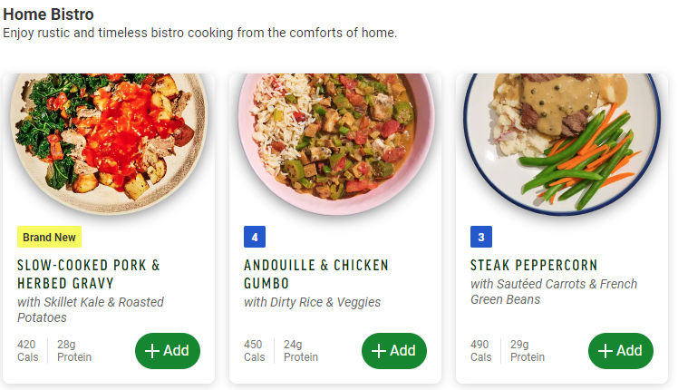

# freshly-show-rating
A script shows your freshly ratings

---



## How to use

1. copy this script 

```javascript
javascript: (function () {
  function getBadge(str) {
    return `<span class="badge meal-card__label mr-1" style="background-color: #2256cd">${str}</span>`
  }
  function append(mealId, html) {
    document
      .querySelector(`div[data-test-meal-id='${mealId}']`)
      .querySelector(".meal-card__meta")
      .insertAdjacentHTML('beforeend', html);
  }

  fetch(`https://www.freshly.com/api/v1/users/${window.FRESHLY.currentUser.id}/ratings`).then(x => x.json()).then(x => {
    x.data.ratings.forEach(e => {
      try {
        append(e.meal_id, getBadge('★'.repeat(e.main_rating)))
      } catch{ }
    });
  });
  fetch(`https://www.freshly.com/api/v1/users/${window.FRESHLY.currentUser.id}/unrated_meals`).then(x => x.json()).then(x => {
    x.data.meal_mains.forEach(e => {
      try {
        append(e.id, getBadge('unrated'))
      } catch{ }
    });
  });

})();
```

2. create a new browser bookmark
3. right click -> edit
4. paste the script in the `URL` field.
5. click it when you choose your new meal!
