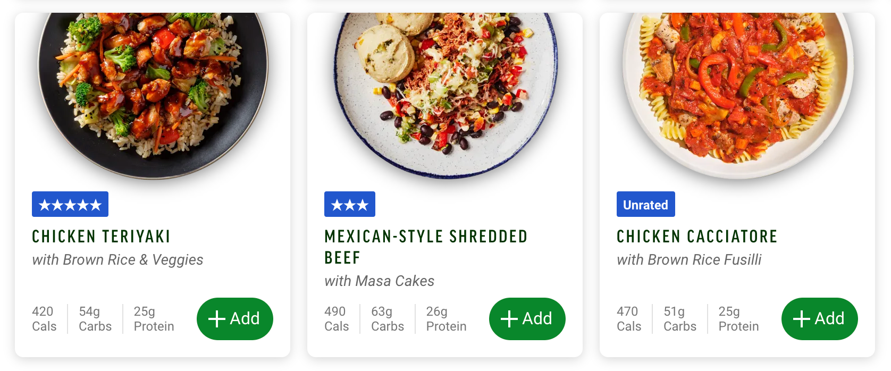

# freshly-show-rating
A script show your freshly ratings

---



## How to use

1. copy this script 

```javascript
javascript: (function () { 
    fetch(`https://www.freshly.com/api/v1/users/${window.FRESHLY.currentUser.id}/ratings`).then(x => x.json()).then(x => {
        x.data.ratings.forEach(e => {
            var str = `<span class="badge meal-card__label mr-1" style="background-color: #2256cd">${e.main_rating}</span>`;
            try {
                document
                    .querySelector(`div[data-test-meal-id='${e.meal_id}']`)
                    .querySelector(".meal-card__meta")
                    .insertAdjacentHTML('beforeend', str);
            } catch{ }
        });
    });
 })();
```

2. create a new browser bookmark
3. right click -> edit
4. paste the script in the `URL` field.
5. click it when you choose your new meal!
